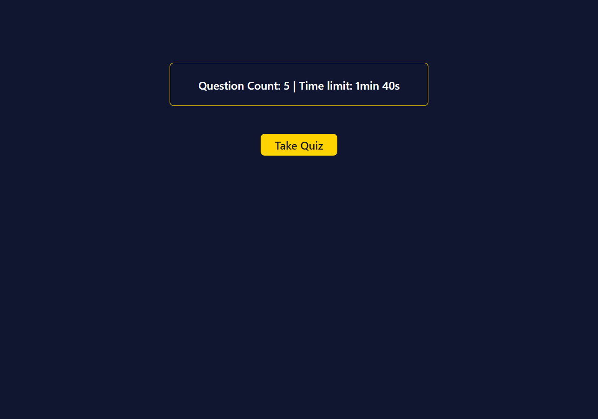
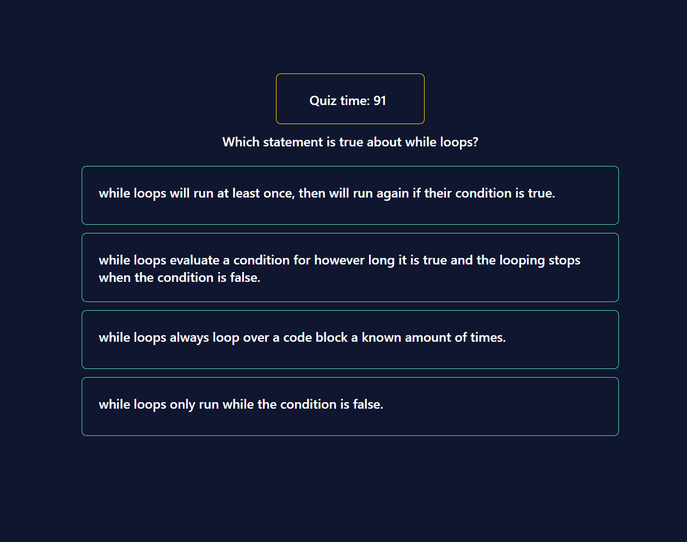
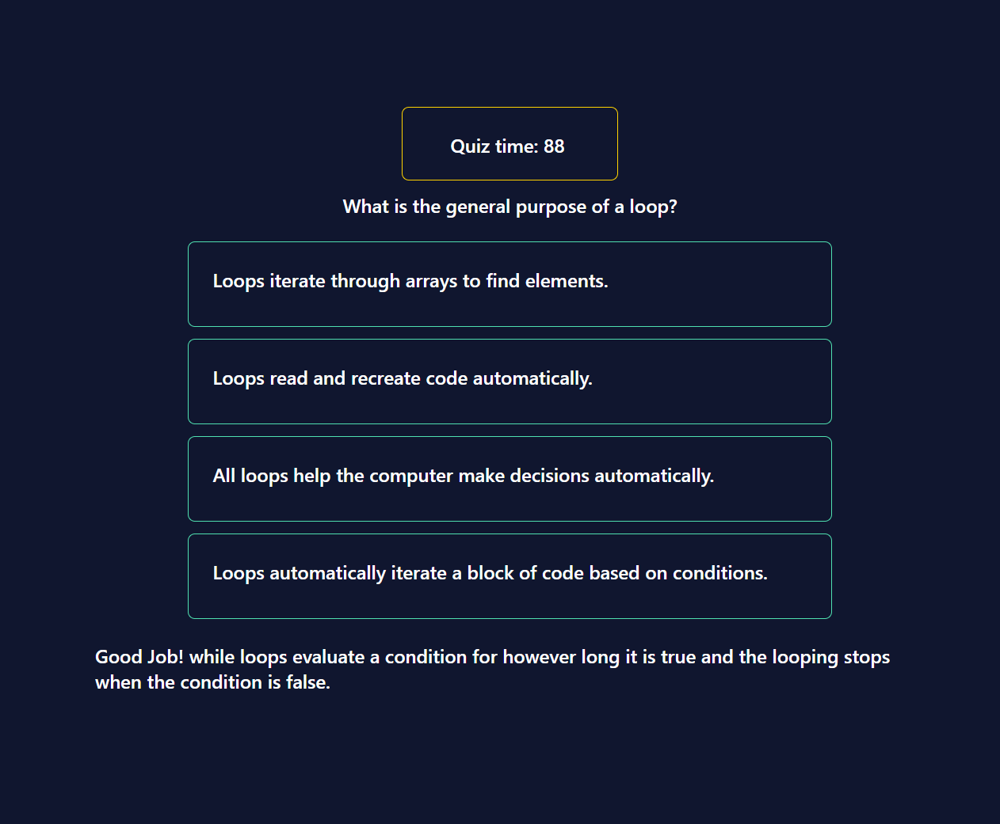
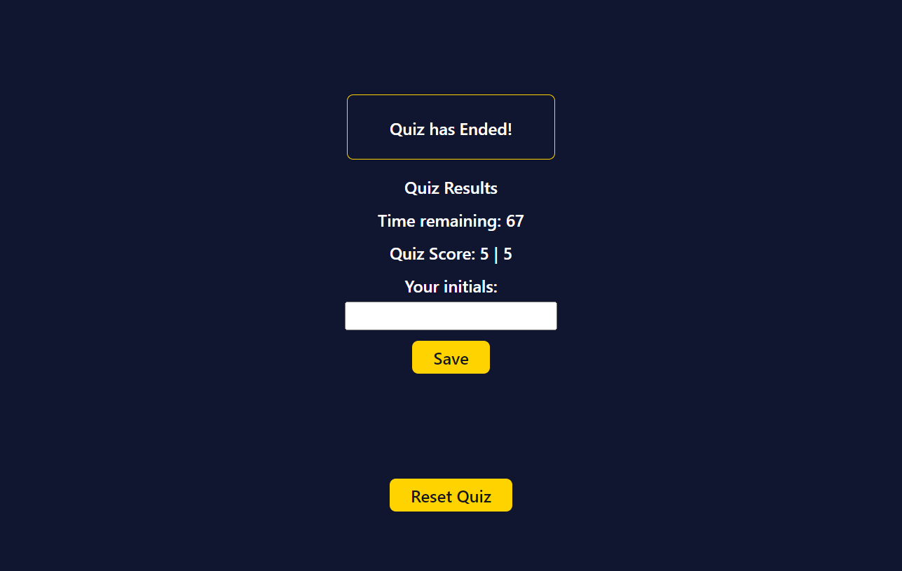
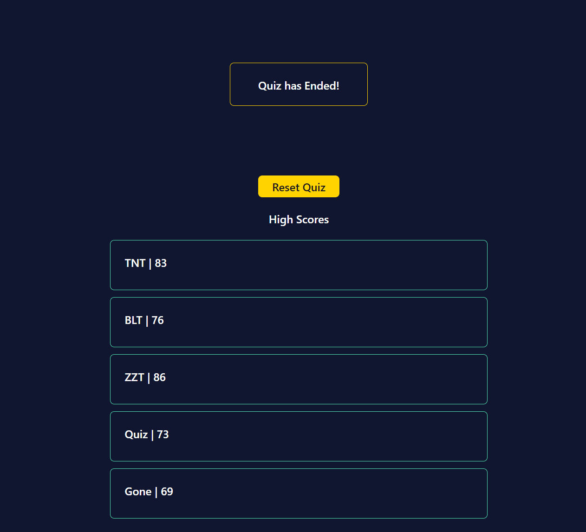

# Programming-Quiz

# Description

This project is a quiz with programming related questions. The quiz deducts time from the clock for incorrect answers. When the quiz is finised the user can enter their intials to save them with their score.  

## About

This project uses JavaScript and web APIs to deliver a basic timed quiz experience. To take the quiz and start the timer the user presses the Take Quiz button. The quiz-clock will begin a countdown. The user is presented with a question and four multiple choice answers. When the correct answer is selected the quiz advances to the next question and no time penalty is deducted from the quiz-clock. When an incorrect answer is selected the quiz advances to the next question, deducts a time penalty from the quiz-clock, and provides the correct answer to the previous question. 

When the user reaches the end of the quiz or time runs out, their score and time remaining is presented along with a form field to input their initials. All scores are saved at the bottom of the page.

The user can retake the quiz if they want to try again by pressing the Reset Quiz button.

## Appearance

### Quiz Start Page

### Quiz Active Page

### Confirmation of previous answer

### Quiz Ended

### Quiz Score History

## View the project

Navigate to [programming-quiz](https://levisgaragegroupinc.github.io/Programming-Quiz/) to view the live page. 

## Credits

The design colors, layout and questions are based on quiz content from codeacademy's JavaScript courses. Visit codeacademy.com for more quiz material and code learning resources. 

Shoutout to UW full stack coding course. Could not have done this without the helpful examples and coaching from instructor, classmates and TAs. 